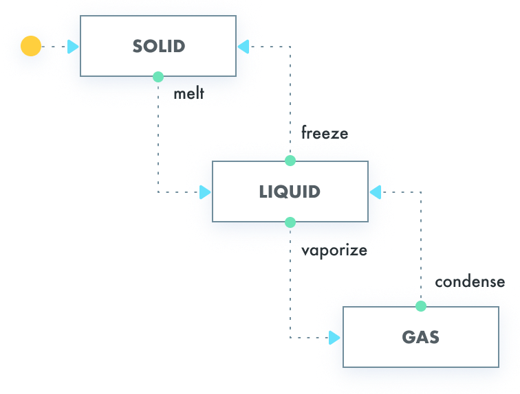

# StateMachine

[](https://circleci.com/gh/Tinder/StateMachine)
[](https://jitpack.io/#tinder/statemachine)

A Kotlin DSL for finite state machine.

`StateMachine` is used in [Scarlet](https://github.com/Tinder/Scarlet)

### Usage

In this example, we create a `StateMachine` from the following state diagram.



Define states, event, and side effects:
~~~kotlin
sealed class State {
    object Solid : State()
    object Liquid : State()
    object Gas : State()
}

sealed class Event {
    object OnMelted : Event()
    object OnFroze : Event()
    object OnVaporized : Event()
    object OnCondensed : Event()
}

sealed class SideEffect {
    object LogMelted : SideEffect()
    object LogFrozen : SideEffect()
    object LogVaporized : SideEffect()
    object LogCondensed : SideEffect()
}
~~~

Declare state transitions:
~~~kotlin
val stateMachine = StateMachine.create<State, Event, SideEffect> {
    initialState(State.Solid)
    state<State.Solid> {
        on<Event.OnMelted> {
            transitionTo(State.Liquid, SideEffect.LogMelted)
        }
    }
    state<State.Liquid> {
        on<Event.OnFroze> {
            transitionTo(State.Solid, SideEffect.LogFrozen)
        }
        on<Event.OnVaporized> {
            transitionTo(State.Gas, SideEffect.LogVaporized)
        }
    }
    state<State.Gas> {
        on<Event.OnCondensed> {
            transitionTo(State.Liquid, SideEffect.LogCondensed)
        }
    }
    onTransition {
        val validTransition = it as? StateMachine.Transition.Valid ?: return@onTransition
        when (validTransition.sideEffect) {
            SideEffect.LogMelted -> logger.log(ON_MELTED_MESSAGE)
            SideEffect.LogFrozen -> logger.log(ON_FROZEN_MESSAGE)
            SideEffect.LogVaporized -> logger.log(ON_VAPORIZED_MESSAGE)
            SideEffect.LogCondensed -> logger.log(ON_CONDENSED_MESSAGE)
        }
    }
}
~~~

Perform state transitions:
~~~kotlin
assertThat(stateMachine.state).isEqualTo(Solid)

// When
val transition = stateMachine.transition(OnMelted)

// Then
assertThat(stateMachine.state).isEqualTo(Liquid)
assertThat(transition).isEqualTo(
    StateMachine.Transition.Valid(Solid, OnMelted, Liquid, LogMelted)
)
then(logger).should().log(ON_MELTED_MESSAGE)
~~~

### Visualization
Thanks to @nvinayshetty, you can visualize your state machines right in the IDE using the [State Arts](https://github.com/nvinayshetty/StateArts) Intellij [plugin](https://plugins.jetbrains.com/plugin/12193-state-art).

### Download

While we are working on Bintray support, `StateMachine` is available via [JitPack][jitpack].

##### Maven:
```xml
<repository>
    <id>jitpack.io</id>
    <url>https://jitpack.io</url>
</repository>
<dependency>
    <groupId>com.github.tinder</groupId>
    <artifactId>statemachine</artifactId>
    <version>0.1.2</version>
</dependency>
```

##### Gradle:
```groovy
repositories {
    // ...
    maven { url "https://jitpack.io" }
}

implementation 'com.github.tinder:statemachine:0.1.2'
```

### License
~~~
Copyright (c) 2018, Match Group, LLC
All rights reserved.

Redistribution and use in source and binary forms, with or without
modification, are permitted provided that the following conditions are met:
    * Redistributions of source code must retain the above copyright
      notice, this list of conditions and the following disclaimer.
    * Redistributions in binary form must reproduce the above copyright
      notice, this list of conditions and the following disclaimer in the
      documentation and/or other materials provided with the distribution.
    * Neither the name of Match Group, LLC nor the names of its contributors
      may be used to endorse or promote products derived from this software
      without specific prior written permission.

THIS SOFTWARE IS PROVIDED BY THE COPYRIGHT HOLDERS AND CONTRIBUTORS "AS IS" AND
ANY EXPRESS OR IMPLIED WARRANTIES, INCLUDING, BUT NOT LIMITED TO, THE IMPLIED
WARRANTIES OF MERCHANTABILITY AND FITNESS FOR A PARTICULAR PURPOSE ARE
DISCLAIMED. IN NO EVENT SHALL MATCH GROUP, LLC BE LIABLE FOR ANY
DIRECT, INDIRECT, INCIDENTAL, SPECIAL, EXEMPLARY, OR CONSEQUENTIAL DAMAGES
(INCLUDING, BUT NOT LIMITED TO, PROCUREMENT OF SUBSTITUTE GOODS OR SERVICES;
LOSS OF USE, DATA, OR PROFITS; OR BUSINESS INTERRUPTION) HOWEVER CAUSED AND
ON ANY THEORY OF LIABILITY, WHETHER IN CONTRACT, STRICT LIABILITY, OR TORT
(INCLUDING NEGLIGENCE OR OTHERWISE) ARISING IN ANY WAY OUT OF THE USE OF THIS
SOFTWARE, EVEN IF ADVISED OF THE POSSIBILITY OF SUCH DAMAGE.
~~~

[latest-jar]: https://tinder.com/
[jitpack]: https://jitpack.io/#tinder/statemachine
